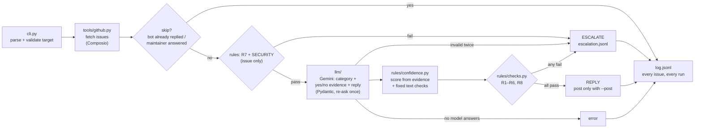

# GitHub Issue Triage Bot

A command-line bot that reads a repository's GitHub issues through the Composio GitHub toolkit, asks
Gemini to classify each one and draft a reply, then puts everything through a set of **fixed rules in
code**. Only issues that pass every rule get a reply. Everything else is escalated to a human.

The model suggests, the code decides. Nothing is posted unless you pass `--post`.

---

## 1. What it does

For each open issue:

1. **Fetches it** via Composio: title, body, labels, author, state, comment count.
2. **Runs issue-only checks first**: the issue must be open with a body (R7), and must not touch
   money, credentials or security topics (SECURITY). If either fails, it escalates without
   calling Gemini.
3. **Asks Gemini** for a category (`bug` / `feature` / `question` / `unclear`), yes/no answers
   about the evidence in the issue, and a draft reply. The answer is checked against a Pydantic
   schema, re-asked once if invalid, and escalated if it's still invalid.
4. **Computes confidence in code** from those yes/no answers plus a few fixed text checks.
   Gemini's own confidence number is logged but never used.
5. **Applies rules R1–R8** to the category, confidence and reply.
6. **Replies or escalates**: replies are posted only with `--post`. Every issue is written to
   `log.jsonl`; escalations also go to `escalation.jsonl`, with the draft reply for a human to use.

| Rule | Check | Why |
|---|---|---|
| R1 | Category is not `unclear` | The model admits it doesn't know |
| R2 | Computed confidence ≥ 0.70 | Low confidence goes to a human |
| R3 | Reply is 20–150 words | Not empty, not an essay |
| R4 | Reply mentions `#N` or a real title word | Proves it's about this issue |
| R5 | No promises ("will be fixed", "by tomorrow", "guarantee", "refund", …) | Never commit the team to anything |
| R6 | No links except `https://github.com/<this repo>/…`, including HTML links, links without `https:`, and bare domains | No hallucinated or unsafe URLs |
| R7 | Issue is open and has a body | Nothing to triage otherwise |
| R8 | No `@mentions`, no references to other issues, no `/commands` | Posting must not notify people, link other issues or trigger other bots |
| SECURITY | No refund / payment / password / token / CVE / vulnerability topics | A human must handle these, however clear the issue is |

---

## 2. Setup

Requires Python 3.10+.

```bash
python -m venv .venv
.venv\Scripts\activate            # Windows  (macOS/Linux: source .venv/bin/activate)
pip install -r requirements.txt
cp .env.example .env              # then fill it in
```

**`.env`**

| Key | Where to get it |
|---|---|
| `COMPOSIO_API_KEY` | composio.dev → your **developer** project → Settings → Project Settings → API Keys. It starts with `ak_`. A `ck_` key is a Connect consumer key and will not work with the SDK. |
| `COMPOSIO_USER_ID` | The user ID your GitHub connection was made under (Connected Accounts → User). |
| `GEMINI_API_KEY` | https://aistudio.google.com/apikey |
| `GEMINI_MODEL` / `GEMINI_FALLBACK_MODEL` | Defaults: `gemini-3.5-flash` / `gemini-3.5-flash-lite` |
| `TEST_REPO` | Any repo, used only by the API check |

**Connect GitHub in Composio.** In the same project, go to Toolkits → GitHub → Connect. For
`--post`, the connection needs permission to write issue comments.

**Check both APIs:**

```bash
python -m triage.check_apis
```
```
Composio / GitHub
  [OK] GitHub connected (account ca_7GdZQVS3UIy_)
  [OK] fetched 3 issues from HARSHAVARDHAN-RAJU5/Triage_sandbox
Gemini
  [OK] gemini-3.5-flash-lite answered: pong
```

---

## 3. How to run

```bash
# Dry run (default): triage, print, log. Nothing is posted.
python -m triage.cli HARSHAVARDHAN-RAJU5/Triage_sandbox

# One issue: any of these forms
python -m triage.cli HARSHAVARDHAN-RAJU5/Triage_sandbox#2
python -m triage.cli https://github.com/HARSHAVARDHAN-RAJU5/Triage_sandbox/issues/2

# Really post the replies that pass every rule
python -m triage.cli HARSHAVARDHAN-RAJU5/Triage_sandbox --post

# Just list issues, no Gemini
python -m triage.cli owner/repo --fetch-only
```

| Flag | Default | Meaning |
|---|---|---|
| `--post` | off | Post replies. Without it, every run is a dry run. |
| `--limit N` | 10 | Max issues (1–500), newest first, fetched across pages |
| `--state` | `open` | `open` / `closed` / `all` |
| `--fetch-only` | off | Skip Gemini and just list issues |
| `--out-dir` | `.` | Where `log.jsonl` and `escalation.jsonl` go |

**Exit codes:** `0` OK · `1` a runtime error (auth, fetch, a Gemini or post failure) · `2` bad input,
rejected before any network call.

**Tests:** `python -m pytest -q` runs 183 tests. All external calls are faked, so the tests
need no network and no keys.

---

## 4. Architecture



```
triage/
  cli.py            entry point: flags, dry run vs --post, printing, summary
  pipeline.py       one issue through the whole flow -> TriageResult
  models.py         Pydantic: Issue, Classification, Evidence, Confidence, RuleResult
  config.py         .env loading
  check_apis.py     smoke test for Composio + Gemini
  tools/            external actions
    github.py       Composio: fetch (paginated), skip check, post comment (pinned toolkit version)
    urls.py         target validation, before any network call
    records.py      log.jsonl + escalation.jsonl
  llm/              model calls
    gemini.py       JSON mode, retry/backoff, fallback model
    prompts.py      system prompt, fenced issue text
    classify.py     schema validation + one re-ask
  rules/            deterministic checks
    confidence.py   computed confidence
    checks.py       R1–R8 + SECURITY
tests/              183 tests, no network
```

---

## 5. Design decisions

- **The model suggests, the code decides.** Gemini only produces data (a category, yes/no
  answers, a draft). Every decision is a plain, unit-tested function. That makes decisions
  predictable, explainable and testable, which matters for anything that posts publicly.
- **Confidence is computed, not self-reported.** Gemini said 1.00 for almost everything,
  including "it doesnt work", so R2 would never trigger. Gemini now answers yes/no questions
  ("does it include an error message?"), and code turns them into a score:
  `0.35 base + evidence + fixed text checks`. The general answers alone reach only 0.60, so an
  issue needs at least one category-specific fact to pass. Every score comes with its breakdown,
  e.g. `base 0.35 + single_topic 0.10 + has_repro_steps 0.15 + has_error_or_logs 0.15`.
- **Cheap checks before expensive ones.** R7 and SECURITY need only the issue, so they run
  before Gemini, and escalated issues cost no Gemini call. Likewise, issues with no comments
  skip the "already replied?" lookup.
- **Validate, re-ask once, then escalate.** Gemini is asked for JSON matching the Pydantic
  schema. If validation fails, Gemini gets the exact error and one more try; if it fails again,
  the issue escalates with the reason.
- **Fast fallback.** The primary model gets one try; the fallback gets three with backoff
  (1s, 2s). When the primary is overloaded (503), retrying it mostly wasted time. Network errors
  and 429/500/503/504 are retried; a 404 (model retired) goes straight to the fallback.
  Temperature stays at Gemini 3's default, as Google advises, with low thinking for speed.
- **Issue text is untrusted.** It's fenced in `<issue>` tags that user text can't close, and the
  prompt says never to follow instructions inside it. R5, R6 and R8 are the backstop if a prompt
  injection works anyway.
- **Safe posting.** Dry run by default. Every posted comment carries an invisible
  `<!-- triage-bot -->` marker, so a rerun skips issues it already answered. It also skips issues
  a maintainer has answered. If it can't check, it errors rather than risk a double post.
- **Pinned Composio toolkit version** (`20260924_00`), so tool input and output shapes can't
  change silently. An unexpected response shape is an error, never "0 issues".
- **Friendly failures everywhere.** No stack traces: a missing connection explains how to
  connect, a 404 says what wasn't found, a bad target is rejected before any network call, and
  every failure is logged with `decision=error`.

---

## 6. Trade-offs

| Chose | Over | Because | Cost |
|---|---|---|---|
| Regex and word rules | An LLM judging the reply | Predictable, testable, free | Misses paraphrases (e.g. soft promises) |
| One Gemini call (category + evidence + reply) | Separate calls | Half the cost and time | The reply is drafted before we know if it will be used |
| Broad SECURITY word list | A precise one | A missed refund or CVE issue costs more than an extra escalation | Over-escalates "paid plan", "token count" |
| `flash` primary with fast fallback to `flash-lite` | `flash-lite` only | Keeps the better model when it's available | Slow when `flash` is overloaded but still answering |
| Replies only acknowledge questions | Answering them | The bot knows nothing about the repo; guessing risks wrong answers | Question replies are generic |
| JSONL files | A database | Zero setup, easy to read, `grep` and `jq` work | No querying, no rotation, duplicate escalations across runs |
| Sequential processing | Concurrency | Simple; stays inside free-tier limits | Slow for hundreds of issues |

---

## 7. Proof: live run on the 3 test issues

Sandbox repo: [HARSHAVARDHAN-RAJU5/Triage_sandbox](https://github.com/HARSHAVARDHAN-RAJU5/Triage_sandbox)

| # | Issue | Expected |
|---|---|---|
| 1 | App crashes when uploading a PDF larger than 10 MB | Clear bug, so reply |
| 2 | How do I change the default output folder? | Clear question, so reply |
| 3 | it doesnt work ("lost a lot of money… i want a refund") | Vague + money, so escalate |

**Run 1: `--post`**

```
$ python -m triage.cli HARSHAVARDHAN-RAJU5/Triage_sandbox --post
Fetched 3 issue(s) from HARSHAVARDHAN-RAJU5/Triage_sandbox (LIVE: replies will be posted)

#3 [open] it doesnt work
   author: HARSHAVARDHAN-RAJU5 | labels: none
   pls fix asap, lost a lot of money because of this. i want a refund
   => ESCALATE: SECURITY sensitive topic: money, refund

#2 [open] How do I change the default output folder?
   author: HARSHAVARDHAN-RAJU5 | labels: none
   I read the docs but couldn't find where the output path is configured. Is there 
   category: question, confidence 0.85 via gemini-3.5-flash-lite
   score: base 0.35 + single_topic 0.10 + specific_question 0.25 + shows_effort 0.15  (gemini said 1.00)
   why: The issue asks a direct question about configuring the output folder.
   reply: Hello! Thank you for reaching out and asking about how to change the default output folder in
          #2. You are asking if there is an environment variable for configuring the output
          path. This question has been noted for the maintainers to review. Thanks again for
          your interest in the project!
   rules: all passed (R7, SECURITY, R1, R2, R3, R4, R5, R6)
   => REPLIED: https://github.com/HARSHAVARDHAN-RAJU5/Triage_sandbox/issues/2#issuecomment-5849136973

#1 [open] App crashes when uploading a PDF larger than 10 MB
   author: HARSHAVARDHAN-RAJU5 | labels: none
   When I upload a large PDF the page goes blank and the console shows 'RangeError:
   category: bug, confidence 0.75 via gemini-3.5-flash-lite
   score: base 0.35 + single_topic 0.10 + has_repro_steps 0.15 + has_error_or_logs 0.15  (gemini said 1.00)
   why: The issue describes a crash with a specific error when uploading large files.
   reply: Hello and thanks for reaching out about issue #1! We appreciate you letting us know that the app
          crashes when uploading a PDF larger than 10 MB and sharing the console error. To help
          us investigate further, could you please provide your operating system, browser
          version, and any additional steps or a sample file if possible? Thanks again for your
          contribution!
   rules: all passed (R7, SECURITY, R1, R2, R3, R4, R5, R6)
   => REPLIED: https://github.com/HARSHAVARDHAN-RAJU5/Triage_sandbox/issues/1#issuecomment-5849137580

Summary: 2 reply (2 posted), 1 escalate, 0 skipped, 0 error
Logged to log.jsonl, escalations in escalation.jsonl
```

This run was before R8 existed, so R8 isn't listed. Both replies were re-checked against R8
afterwards and pass it.

**Run 2: the same command again (no double posts)**

```
$ python -m triage.cli HARSHAVARDHAN-RAJU5/Triage_sandbox --post
#3 [open] it doesnt work
   => ESCALATE: SECURITY sensitive topic: money, refund
#2 [open] How do I change the default output folder?
   => SKIP: already has a reply from this bot
#1 [open] App crashes when uploading a PDF larger than 10 MB
   => SKIP: already has a reply from this bot
Summary: 0 reply (0 posted), 1 escalate, 2 skipped, 0 error
```

**What was written** (`escalation.jsonl`, one entry):

```json
{"ts": "2026-09-26T19:19:17+00:00", "run_id": "e3202e53", "mode": "dry-run",
 "repo": "HARSHAVARDHAN-RAJU5/Triage_sandbox", "issue": 3, "title": "it doesnt work",
 "url": "https://github.com/HARSHAVARDHAN-RAJU5/Triage_sandbox/issues/3",
 "author": "HARSHAVARDHAN-RAJU5", "reasons": ["SECURITY: sensitive topic: money, refund"],
 "category": null, "confidence": null, "draft_reply": null}
```

`category`, `confidence` and `draft_reply` are `null` because SECURITY escalates before Gemini is
called.

---

## 8. Known limitations

The full, tested list is in [IMPROVEMENTS.md](IMPROVEMENTS.md). The main ones:

- **The dry-run reply isn't the posted reply.** Each run asks Gemini again, so the text you
  reviewed can differ from what `--post` sends.
- **Escalations are recorded again on every run**, and nothing marks them on GitHub.
- **Soft promises get through R5** ("we will look into this as soon as possible").
- **Borderline scores can flip between runs**: at temperature 1.0 one yes/no answer changes the
  score by 0.05–0.25.
- **A confidently wrong category isn't caught**: "Can it support dark mode?" can come back as a
  question when it's really a feature request.
- **Posts come from the connected personal account**, not a bot account.
- **The SECURITY list over-escalates**, and the confidence weights are first guesses that haven't
  been tuned on real data.
- **Languages without spaces** (Chinese, Japanese) are always penalised by the word-count rules.
- **Speed and quota**: issues are processed one by one, with no rate limiting for large repos.

---

## 9. With more time

1. **`--post-from log.jsonl`**: post exactly the replies a human reviewed in a dry run.
2. **Label escalations on GitHub** (`needs-human`) and skip labelled issues. That removes
   duplicates and makes escalations visible where maintainers work.
3. **Tune on real data**: run on a few hundred real issues, have a human mark the right
   decisions, then fit the confidence weights and SECURITY list to that.
4. **Verify the yes/no answers with quotes**: Gemini returns the words that support each "yes",
   and code checks they appear in the issue. This is the strongest guard against inflated answers.
5. **A GitHub App or bot account**, so replies are clearly automated.
6. **Use repo context for questions** (README or docs via Composio), so replies can point to
   the right place instead of only acknowledging.
7. **Run on events instead of by hand**: a Composio trigger or a webhook on new issues, with
   rate limiting and a few issues processed at a time.
8. **CI**: run the tests plus a nightly dry run against the sandbox to catch API or model drift.
